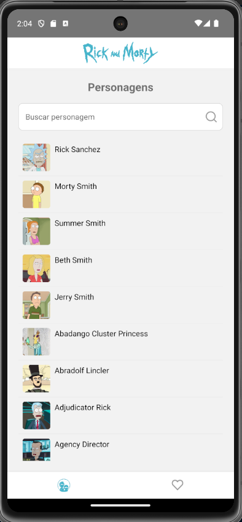
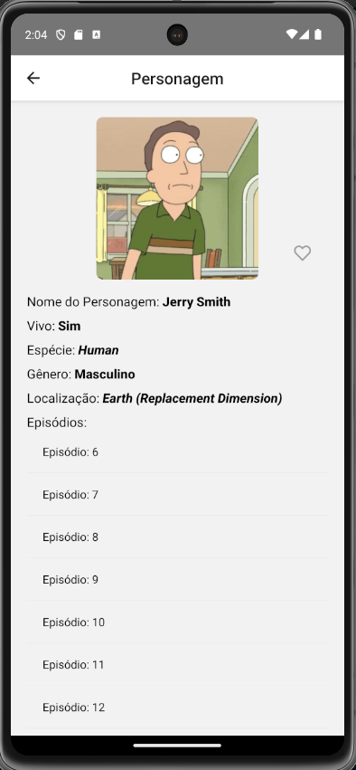
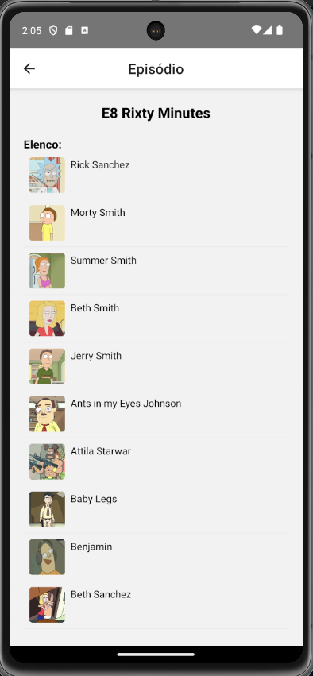
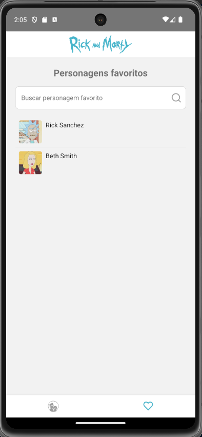

# Bem vindos a minha versão do RMApp

## Evidências

## A escolha do projeto

Bom, escolhi esse projeto pois achei a documentação da API mais simples e direta.

## Como testar e rodar a aplicação

- Primeiro clone o projeto;
- Em seguida, na raiz do projeto rode o comando:
  `yarn`
- Após, rode:
  `yarn start`
  `yarn android` e/ou `yarn ios`;

- O teste é bem simples, é só seguir alguns fluxos, tais como:
  - Filtrar pelo personagem;
  - Clicar em algum personagem para ver as informações e também favoritá-lo ou "desfavoritá-lo" se quiser;
  - Abrir algum episódio, e por aí vai.

## Observações

Curti o desenvolvimento desse teste.
Api legal, proposta boa.
Reconheço que tem alguns pontos de melhorias, algumas refatorações, mas acredito que tenha atendido a maioria dos critérios e pude mostrar um pouco de João dev (rs).

Bom, fiquei muito grato pela oportunidade.
Fico à disposição.

Obrigado!
